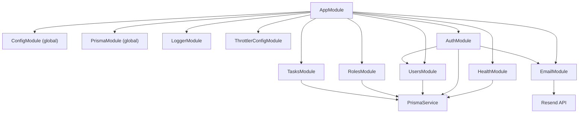

# backend-base


A production-ready NestJS 11 backend starter with JWT authentication, role-based access control, session management, email integration, and more. Built as a reusable foundation for future projects. Includes a complete auth flow (register, login, email verification, password reset), granular permissions with RBAC, session tracking with one-time-use refresh tokens, rate limiting, structured logging, Swagger docs, health checks, and scheduled cleanup tasks — all wired up and ready to go.

## Tech Stack

| Category | Technology |
|----------|-----------|
| Framework | NestJS 11 |
| Language | TypeScript 5.9 (strict mode) |
| ORM | Prisma 7 (with PgPool driver adapter) |
| Database | PostgreSQL 16 |
| Auth | Passport JWT + httpOnly refresh cookies |
| Email | Resend |
| Validation | class-validator (DTOs) + Zod (env vars) |
| Logging | Pino (structured, via nestjs-pino) |
| Rate Limiting | @nestjs/throttler |
| Health Checks | @nestjs/terminus |
| API Docs | @nestjs/swagger |
| Security | Helmet, bcryptjs |
| Testing | Jest + Supertest |
| Container | Docker Compose (Postgres only) |

## Features

- **Authentication** — Register, login, logout, JWT access tokens, one-time-use refresh tokens via httpOnly cookie, email verification, password reset flow, change password.
- **Session Management** — Track active sessions with metadata (IP, user-agent), terminate specific or all sessions, automatic cleanup of expired sessions via cron.
- **RBAC** — Role-based access control with granular permissions, system-protected roles (admin/user), permission assignment to roles, guard-based enforcement via `@RequirePermissions()` decorators.
- **User Management** — CRUD operations, profile updates, activate/deactivate users, role assignment, paginated listing with filters (status, name, email).
- **Role Management** — Create, read, update, delete roles with permission associations. System roles are protected from modification and deletion. Cascade protection prevents deleting roles currently assigned to users.
- **Email** — Verification emails and password reset emails sent via Resend with MJML-compiled HTML templates.
- **Health Checks** — Terminus-based health endpoint with Prisma connectivity ping.
- **Rate Limiting** — Configurable per-route throttling with separate limits for auth routes vs general API. All configurable via environment variables.
- **Structured Logging** — Pino logger with HTTP request serialization, sensitive data redaction, and request correlation IDs.
- **Swagger Docs** — OpenAPI documentation at `/docs`, protected with HTTP Basic Auth.
- **Scheduled Tasks** — Cron-based cleanup of expired sessions (daily at 1:00 AM) and verification tokens (daily at midnight).

## Security

- Passwords hashed with bcrypt (cost factor 12)
- Timing-attack prevention — dummy bcrypt hash returned on user-not-found to prevent enumeration
- One-time-use refresh tokens stored as SHA-256 hashes in the database
- httpOnly, secure refresh token cookies
- All routes are JWT-protected by default; public routes opt-in via `@Public()` decorator
- Permission-based authorization enforced via `@RequirePermissions()` decorators and `PermissionsGuard`
- `NotSelfGuard` prevents users from deactivating their own accounts
- Helmet security headers applied to all responses
- Rate limiting prevents brute-force and abuse
- Input validation with class-validator (`whitelist: true`, `forbidNonWhitelisted: true`)
- Environment variables validated at startup with Zod — app won't start with missing/invalid config
- No stack traces or internal details exposed in error responses (`AppExceptionFilter`)
- CORS origins configurable via environment variables

## Architecture



**Request flow:** Request → ThrottlerGuard → JwtAuthGuard → PermissionsGuard → Controller → Service → PrismaService → PostgreSQL

## Quick Start

### Prerequisites

- Node.js >= 18
- pnpm (this project uses pnpm 10.28.1)
- Docker (for PostgreSQL)

### Setup

```bash
# Clone the repository
git clone https://github.com/David-Corona/backend-base.git
cd backend-base

# Install dependencies
pnpm install

# Start PostgreSQL
docker compose up -d

# Configure environment variables
cp .env.example .env
# Edit .env — at minimum set JWT_SECRET and RESEND_API_KEY

# Generate Prisma client
pnpm prisma:generate

# Run database migrations
pnpm prisma migrate dev

# Seed the database (creates admin/user roles and permissions)
pnpm prisma db seed

# Start the development server
pnpm start:dev
```

The server starts at `http://localhost:3000`. API routes are prefixed with `/api`.

### Swagger Docs

Access the interactive API documentation at `http://localhost:3000/docs`. Login with the admin credentials configured in your `.env` file (`ADMIN_USER` / `ADMIN_PASSWORD`).

## API Overview

### Auth (`/api/auth`)

| Method | Endpoint | Auth | Description |
|--------|----------|------|-------------|
| POST | `/auth/register` | Public | Register a new user |
| POST | `/auth/login` | Public | Login (returns JWT + refresh cookie) |
| POST | `/auth/refresh` | Public | Refresh access token |
| POST | `/auth/logout` | Public | Logout (clears refresh cookie) |
| POST | `/auth/verify-email` | Public | Verify email with token |
| POST | `/auth/resend-verification` | Public | Resend verification email |
| POST | `/auth/forgot-password` | Public | Request password reset |
| POST | `/auth/reset-password` | Public | Reset password with token |
| POST | `/auth/change-password` | Protected | Change password (requires current) |
| GET | `/auth/sessions` | Protected | List user sessions (paginated) |
| DELETE | `/auth/sessions/:id` | Protected | Terminate a specific session |
| DELETE | `/auth/sessions` | Protected | Terminate all other sessions |

### Users (`/api/users`)

| Method | Endpoint | Permission | Description |
|--------|----------|------------|-------------|
| GET | `/users` | `users:read` | List users (paginated, filterable) |
| GET | `/users/me` | — | Get current user profile |
| GET | `/users/:id` | `users:read` | Get user by ID |
| POST | `/users` | `users:write` | Create user (admin) |
| PATCH | `/users/me` | — | Update own profile |
| PATCH | `/users/:id` | `users:write` | Update user |
| DELETE | `/users/:id` | `users:delete` | Deactivate user |
| PATCH | `/users/:id/activate` | `users:write` | Activate user |
| PATCH | `/users/:id/role` | `users:assign-role` | Assign role to user |
| GET | `/users/:userId/sessions` | `users:read` | List user sessions |
| DELETE | `/users/:userId/sessions/:id` | `users:write` | Terminate user session |
| DELETE | `/users/:userId/sessions` | `users:write` | Terminate all user sessions |

### Roles (`/api/roles`)

| Method | Endpoint | Permission | Description |
|--------|----------|------------|-------------|
| GET | `/roles` | `roles:read` | List roles (paginated) |
| GET | `/roles/:id` | `roles:read` | Get role by ID |
| POST | `/roles` | `roles:write` | Create role |
| PATCH | `/roles/:id` | `roles:write` | Update role |
| DELETE | `/roles/:id` | `roles:delete` | Delete role |

### Permissions (`/api/permissions`)

| Method | Endpoint | Permission | Description |
|--------|----------|------------|-------------|
| GET | `/permissions` | `roles:read` | List all permissions |

### Health (`/api/health`)

| Method | Endpoint | Auth | Description |
|--------|----------|------|-------------|
| GET | `/health` | Public | Health check with Prisma ping |

> Full interactive API documentation available at [`/docs`](/docs) (Swagger UI).

## Environment Variables

| Variable | Default | Description |
|----------|---------|-------------|
| `NODE_ENV` | `development` | Application environment |
| `PORT` | `3000` | Server port |
| `DATABASE_URL` | — | PostgreSQL connection string |
| `JWT_SECRET` | — | Secret key for signing JWTs |
| `JWT_ACCESS_TOKEN_EXPIRATION` | `15m` | Access token time-to-live |
| `JWT_REFRESH_TOKEN_EXPIRATION` | `7d` | Refresh token time-to-live |
| `PASSWORD_RESET_TOKEN_EXPIRATION` | `1h` | Password reset token TTL |
| `EMAIL_VERIFICATION_TOKEN_EXPIRATION` | `24h` | Email verification token TTL |
| `RATE_LIMIT_TTL` | `60000` | Rate limit window in milliseconds |
| `RATE_LIMIT_DEFAULT` | `60` | Max requests per window (default routes) |
| `RATE_LIMIT_AUTH` | `10` | Max requests per window (auth routes) |
| `RESEND_API_KEY` | — | Resend email service API key |
| `FROM_EMAIL` | `noreply@example.com` | Sender email address |
| `ALLOWED_ORIGINS` | — | Comma-separated CORS allowed origins |
| `TRUST_PROXY` | `0` | Number of reverse proxies to trust |
| `ADMIN_USER` | `admin` | HTTP Basic Auth username for Swagger docs |
| `ADMIN_PASSWORD` | `change-me` | HTTP Basic Auth password for Swagger docs |

## Project Structure

```
src/
├── main.ts                    # Entry point
├── bootstrap.ts               # App configuration (pipes, filters, CORS, Swagger, helmet)
├── app.module.ts              # Root module
├── config/                    # Env validation (Zod), ConfigModule, ThrottlerModule
├── prisma/                    # Global PrismaService (PrismaClient + PgPool adapter)
├── logger/                    # Pino logger configuration
├── common/                    # Shared utilities
│   ├── decorators/            # @Public, @CurrentUser, @RequirePermissions, @IsPassword
│   ├── guards/                # JwtAuthGuard, PermissionsGuard, NotSelfGuard
│   ├── filters/               # Global AppExceptionFilter
│   ├── exceptions/            # AppException hierarchy
│   ├── dto/                   # Shared response/pagination DTOs
│   └── utils/                 # Pagination helpers
└── modules/
    ├── auth/                  # JWT auth, sessions, email verification, password reset
    ├── users/                 # User CRUD, profile, role assignment, session management
    ├── roles/                 # Role CRUD, permission listing
    ├── health/                # Terminus health checks with Prisma indicator
    ├── email/                 # Resend email service with MJML templates
    └── tasks/                 # Scheduled cleanup (expired sessions, tokens)
```

## API Conventions

### Error Responses

All errors return a consistent shape:

```json
{
  "statusCode": 404,
  "error": "Not Found",
  "message": "User not found",
  "code": "USER_NOT_FOUND"
}
```

Stack traces, Prisma errors, and internal details are never exposed.

### Response Shapes

| Shape | Format |
|-------|--------|
| Single resource | DTO returned directly, no wrapper |
| Paginated list | `{ data: [...], meta: { total, page, limit, totalPages } }` |
| Empty success | HTTP `204 No Content`, no body |
| Confirmation | HTTP `200 OK` with `{ "message": "..." }` |

### Pagination

| Param | Type | Default | Max |
|-------|------|---------|-----|
| `page` | number | 1 | — |
| `limit` | number | 25 | 100 |

### Timestamps

All timestamps use ISO 8601 UTC format: `2024-01-01T00:00:00.000Z`.

### HTTP Status Codes

Standard semantics with two notable choices:
- Delete/logout returns **204 No Content**, not 200
- Conflict (duplicate email, unique constraint) returns **409**, not 400

## License

Private — All rights reserved.
